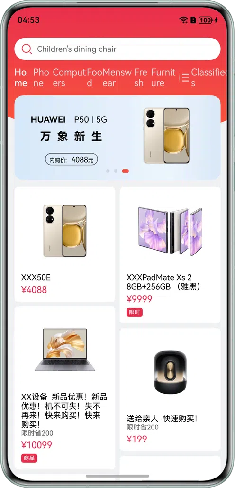

# WaterFlow Container

### Introduction

Learn how to implement waterfall layout based on the **WaterFlow** container.

### Concepts

- WaterFlow: a waterfall container that consists of cells formed by rows and columns and arranges items of different sizes from top to bottom according to the preset rules.
- FlowItem: a child component of the waterfall container.
- LazyForEach: iterates over provided data sources and creates corresponding components during each iteration. When **LazyForEach** is used in a scrolling container, the framework creates components as required within the visible area of the scrolling container. When a component is out of the visible area, the framework destroys and reclaims the component to reduce memory usage.

### Permissions

N/A

### How to Use

1. Open the app and swipe up or down to display the waterfall layout.

### Constraints

1. The sample is only supported on Huawei phones with standard systems.
2. HarmonyOS: HarmonyOS 5.0.5 Release or later.
3. DevEco Studio: DevEco Studio 6.0.0 Release or later.
4. HarmonyOS SDK: HarmonyOS 6.0.0 Release SDK or later.
