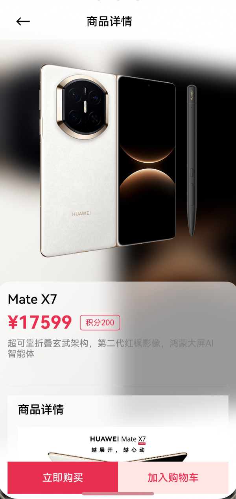
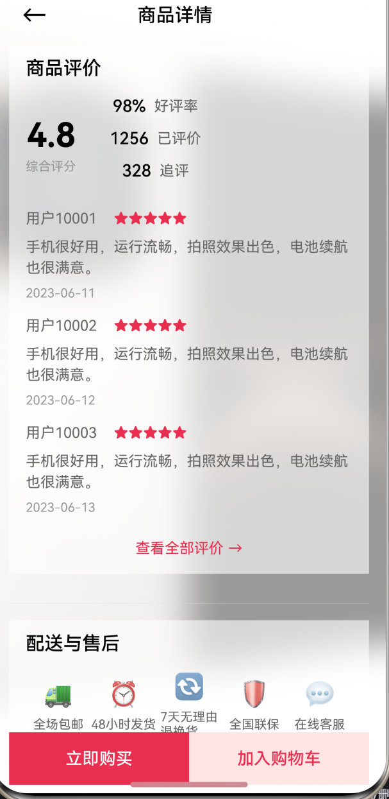
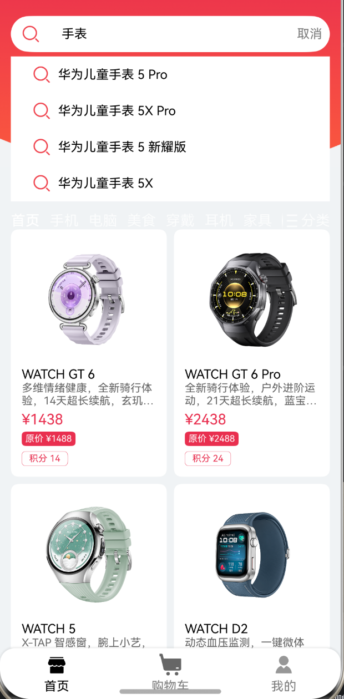
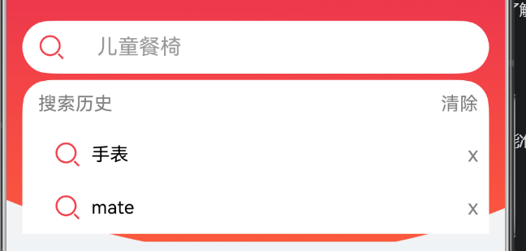
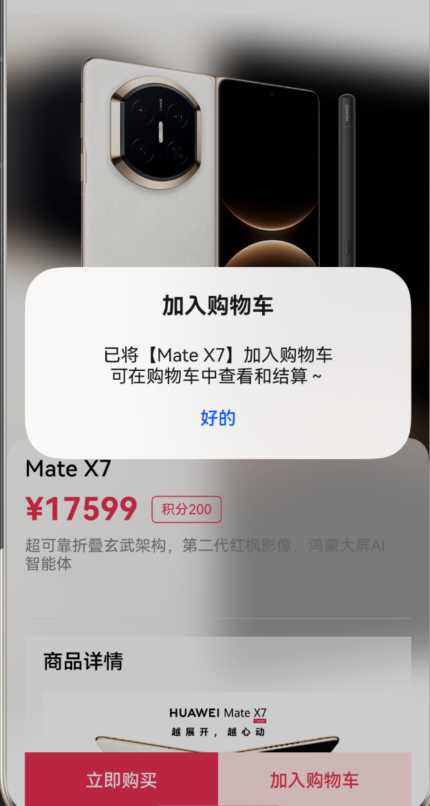
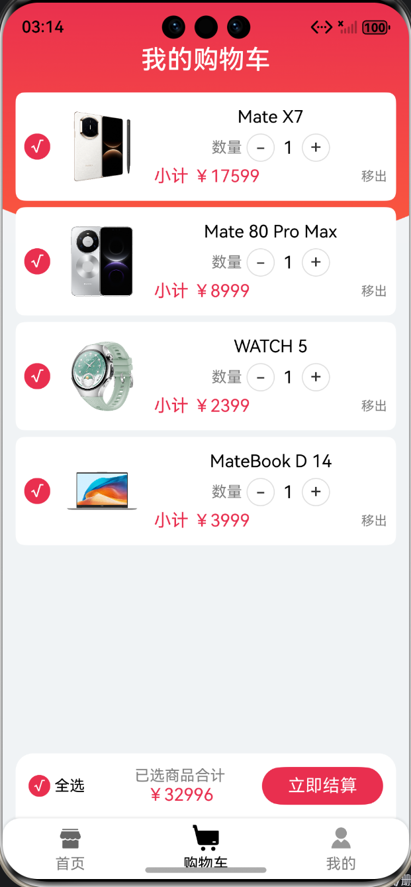
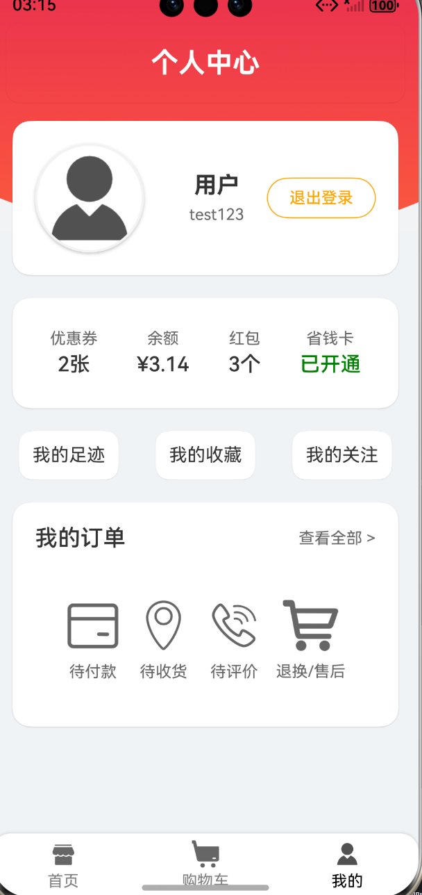

# VMALL(华为商城)应用

## 项目简介

VMALL是基于HarmonyOS系统开发的华为商城应用，实现了商品展示、搜索、购物车和个人中心等核心电商功能。应用采用现代化的UI设计和流畅的交互体验，为用户提供便捷的购物服务。

**关键技术与组件**：
- **WaterFlow容器**：实现商品列表的瀑布流布局，支持不同大小商品卡片的自适应排列
- **LazyForEach**：按需加载商品数据，优化滚动性能和内存占用
- **Swiper组件**：实现首页轮播图功能，展示推荐商品
- **Tabs组件**：实现底部导航栏，支持首页、分类、购物车、我的等页面切换

### 扩展功能

- 商品详情页
- 商品搜索功能
- 购物车管理
- 个人中心


## 小组分工

本项目由四人小组协作完成，具体分工如下：

| 成员   | 负责模块         | 主要职责                                                                 |
| ------ | ---------------- | ------------------------------------------------------------------------ |
| 马民泽  | 搜索功能         | 负责搜索结果展示、搜索历史记录管理、搜索关键词处理         |
| 姜乐   | 商品详情页       | 负责商品详情页UI布局、商品信息展示、图片浏览等         |
| 胡炜康  | 个人中心         | 负责个人中心页面设计、用户信息展示、订单管理入口         |
| 田炎烁  | 购物车功能       | 负责购物车页面设计、商品调整功能、结算流程实现             |


## 扩展功能实现

### 1. 商品详情页

**功能描述**：展示商品的详细信息，包括商品图片、名称、价格、描述、评价、售后等。

**实现方案**：
- 使用`ProductDetailPage.ets`实现商品详情页
- 采用多层级布局展示商品信息，包括商品基本信息、详细描述等
- 实现加入购物车等交互功能

**核心文件**：
- `entry/src/main/ets/pages/ProductDetailPage.ets`
- `entry/src/main/ets/viewmodel/ProductItem.ets`

**展示图片**：


<br>


### 2. 搜索功能

**功能描述**：允许用户通过关键词搜索商品，并展示搜索结果。

**实现方案**：
- 开发`SearchComponent.ets`搜索组件，集成在首页顶部
- 实现搜索框输入、搜索按钮点击事件处理
- 使用`LazyForEach`按需加载搜索结果，优化性能
- 支持搜索历史记录和热门搜索词展示

**核心文件**：
- `entry/src/main/ets/view/SearchComponent.ets`
- `entry/src/main/ets/viewmodel/HomeViewModel.ets`

**展示图片**：

- 搜索功能实现展示：



- 搜索历史功能展示：



### 3. 购物车

**功能描述**：管理用户添加的商品，支持商品数量调整、删除、结算等操作。

**实现方案**：
- 创建`CartPage.ets`购物车页面
- 使用本地存储模拟购物车数据的持久化
- 实现商品数量增减、全选/取消全选、删除商品等功能
- 计算商品总价和数量统计

**核心文件**：
- `entry/src/main/ets/pages/CartPage.ets`

**展示图片**：

- 加入购物车的功能展示：



- 购物车商品列表展示：



- 购物车结算功能展示：


### 4. 个人中心

**功能描述**：用户个人中心，展示用户信息和相关功能入口。

**实现方案**：
- 设计个人中心页面布局，包括用户头像、昵称、订单信息等
- 实现订单管理、地址管理、收藏夹等功能入口
- 提供设置选项，如主题切换、消息通知等

**核心文件**：
- 相关资源：`entry/src/main/ets/assets/我的.png`

**展示图片**：




## 技术实现

### 相关概念

- **WaterFlow**：瀑布流容器，用于实现商品列表的不规则布局
- **FlowItem**：瀑布流容器的子组件，用于展示单个商品卡片
- **LazyForEach**：按需迭代数据并创建组件，优化滚动性能和内存占用
- **Swiper**：轮播图组件，用于首页商品推荐展示
- **Tabs**：标签页组件，用于实现底部导航栏（首页、分类、购物车、我的）

### 项目结构

```
entry/src/main/ets/
├── assets/          # 静态资源文件
├── common/          # 通用常量和工具类
├── entryability/    # 应用入口
├── pages/           # 页面组件
│   ├── CartPage.ets        # 购物车页面
│   ├── HomePage.ets        # 首页
│   └── ProductDetailPage.ets # 商品详情页
├── view/            # 自定义组件
│   ├── ClassifyComponent.ets  # 分类组件
│   ├── FlowItemComponent.ets  # 瀑布流项组件
│   ├── SearchComponent.ets    # 搜索组件
│   ├── SwiperComponent.ets    # 轮播图组件
│   └── WaterFlowComponent.ets # 瀑布流容器组件
└── viewmodel/       # 视图模型
    ├── HomeViewModel.ets       # 首页视图模型
    ├── ProductItem.ets         # 商品数据模型
    └── WaterFlowDataSource.ets # 瀑布流数据源
```

### 关键数据结构

#### 商品数据结构 (ProductItem)

```typescript
export interface IProductItem {
  /**
   * 商品图片URL
   */
  image_url: string;

  /**
   * 商品名称
   */
  name: string;

  /**
   * 商品简单描述
   */
  discount: string;

  /**
   * 商品价格
   */
  price: string;

  /**
   * 商品促销信息
   */
  promotion: string;

  /**
   * 商品积分
   */
  bonus_points: string;

  /**
   * 商品详情
   */
  detail: string | string[];

  /**
   * 商品分类索引 (0: 首页, 1: 手机, 2: 电脑, 3: 美食, 4: 穿戴, 5: 耳机, 6: 家具)
   */
  category: number;
}
```

**核心字段说明**：
- `image_url`: 商品图片的网络地址或本地资源路径
- `name`: 商品的完整名称
- `discount`: 商品折扣信息，如"8.5折"
- `price`: 商品价格，如"¥1999"
- `promotion`: 商品促销活动信息，如"满1000减100"
- `bonus_points`: 购买商品可获得的积分
- `detail`: 商品详细描述，支持字符串或字符串数组格式
- `category`: 商品分类索引，用于分类筛选和展示

## 使用说明

1. 启动应用，进入首页查看瀑布流展示的商品
2. 点击商品卡片进入商品详情页
3. 使用顶部搜索框搜索商品
4. 点击底部导航栏进入购物车页面
5. 点击底部导航栏进入个人中心

## 约束与限制

1. 本应用仅支持华为手机运行
2. HarmonyOS系统版本：HarmonyOS 5.0.5 Release及以上
3. DevEco Studio版本：DevEco Studio 6.0.0 Release及以上
4. HarmonyOS SDK版本：HarmonyOS 6.0.0 Release SDK及以上


