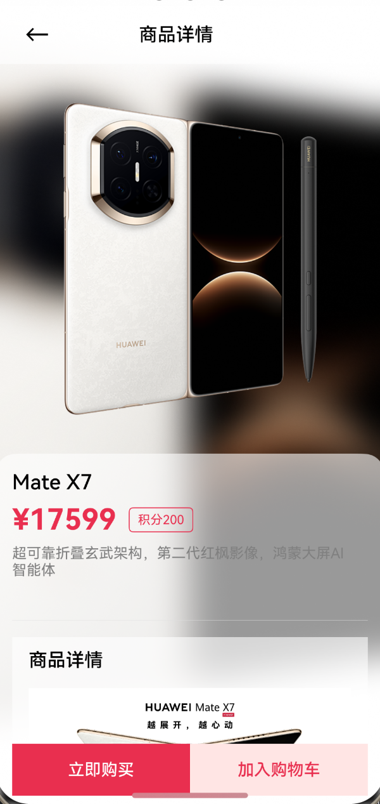
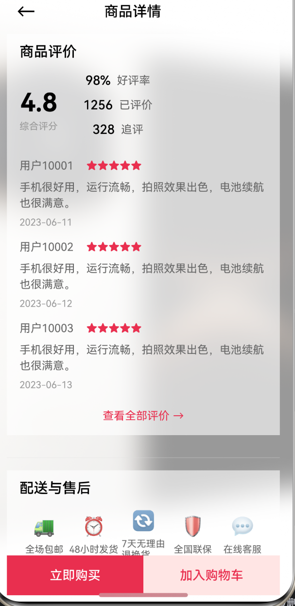
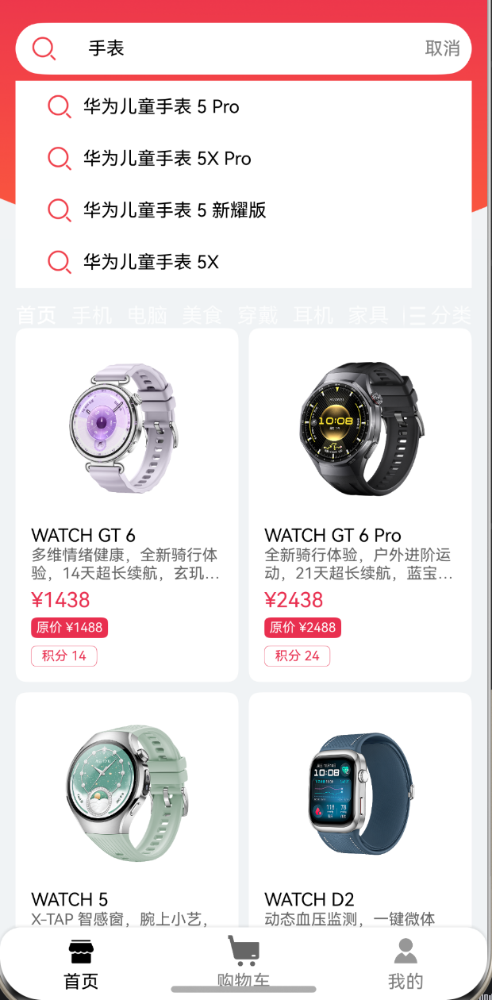
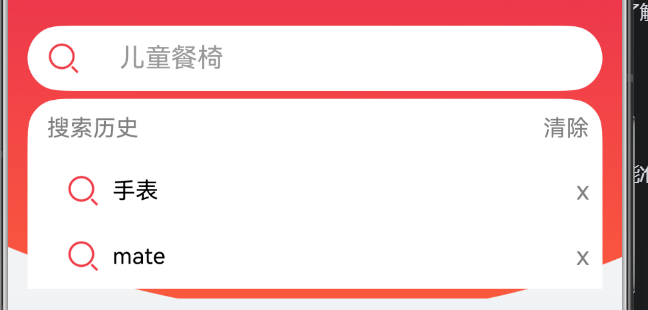
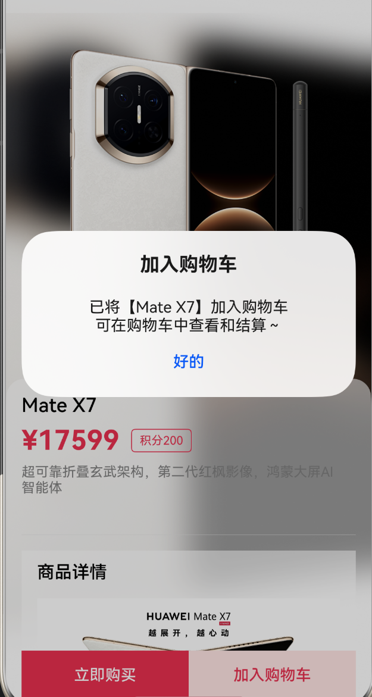
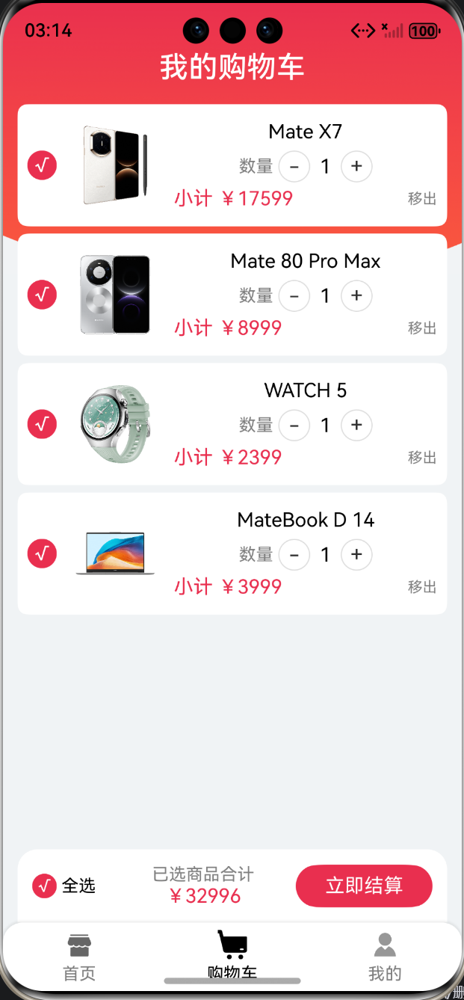
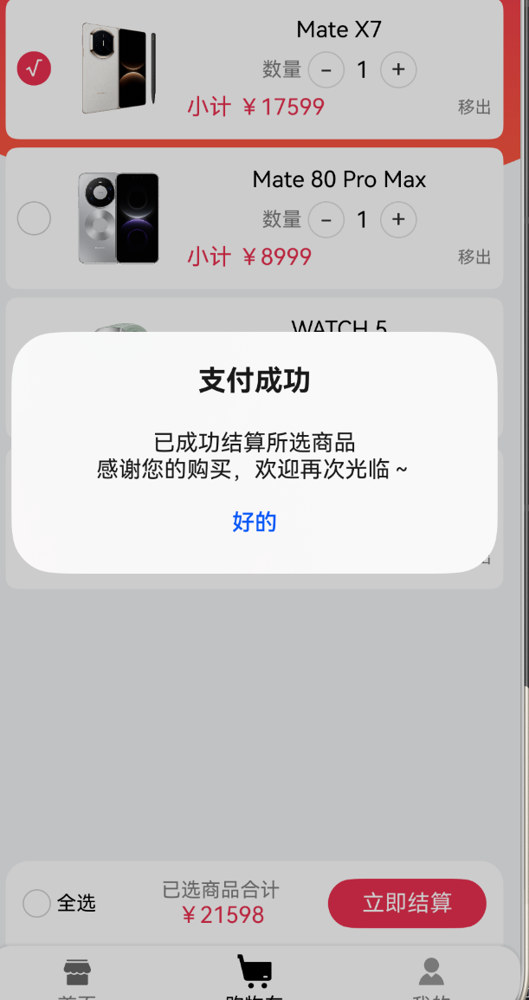
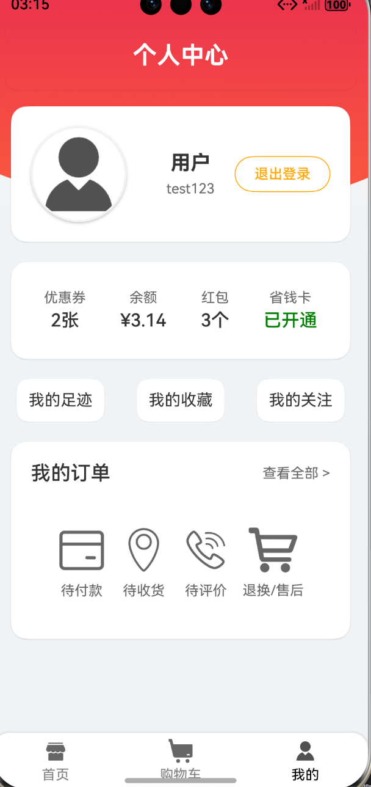

# VMALL(华为商城)应用

## 项目简介

VMALL是基于HarmonyOS系统开发的华为商城应用，实现了商品展示、搜索、购物车和个人中心等核心电商功能。应用采用现代化的UI设计和流畅的交互体验，为用户提供便捷的购物服务。

## 小组分工

本项目由四人小组协作完成，具体分工如下：

| 成员   | 负责模块                                   | 主要职责                                                     |
| ------ | ------------------------------------------ | ------------------------------------------------------------ |
| 马民泽 | 搜索功能,我的收藏样例界面                  | 负责搜索结果展示、搜索历史记录管理、搜索关键词处理、我的收藏 |
| 姜乐   | 商品详情页,我的关注样例界面                | 负责商品详情页UI布局、商品信息展示、图片浏览等、我的关注     |
| 胡炜康 | 个人中心页,待付款、收货样例                | 负责个人中心页面设计、用户信息展示、待付款、待收货订单管理   |
| 田炎烁 | 购物车,我的足迹,待评价、退换样例，样例后端 | 负责购物车功能、我的足迹、待评价退换、样例后端实现           |

## 主要实现

- 首页商品瀑布流展示
- 商品详情展示
- 购买商品
- 购物车管理及结算
- 浏览足迹、收藏、关注示例
- 待付款、待收货、待评价、退换页面示例
- 基于java spring boot的管理与存储后端

## 前端介绍

### 项目结构

```
entry/src/main/ets/
├── assets/          # 静态资源文件
├── common/          # 通用常量和工具类
├── entryability/    # 应用入口
├── pages/           # 页面组件
│   ├── CartPage.ets        # 购物车页面
│   ├── HomePage.ets        # 首页
│   └── ProductDetailPage.ets # 商品详情页
├── view/            # 自定义组件
│   ├── ClassifyComponent.ets  # 分类组件
│   ├── FlowItemComponent.ets  # 瀑布流项组件
│   ├── SearchComponent.ets    # 搜索组件
│   ├── SwiperComponent.ets    # 轮播图组件
│   └── WaterFlowComponent.ets # 瀑布流容器组件
└── viewmodel/       # 视图模型
    ├── HomeViewModel.ets       # 首页视图模型
    ├── ProductItem.ets         # 商品数据模型
    └── WaterFlowDataSource.ets # 瀑布流数据源
```

**关键技术与组件**：

- **WaterFlow容器**：实现商品列表的瀑布流布局，支持不同大小商品卡片的自适应排列
- **LazyForEach**：按需加载商品数据，优化滚动性能和内存占用
- **Swiper组件**：实现首页轮播图功能，展示推荐商品
- **Tabs组件**：实现底部导航栏，支持首页、分类、购物车、我的等页面切换

### 扩展功能

- 商品详情页
- 商品搜索功能
- 购物车管理
- 个人中心
- 足迹、收藏、关注、订单管理样例

### 功能实现

#### 1. 商品详情页

**功能描述**：展示商品的详细信息，包括商品图片、名称、价格、描述、评价、售后等。

**实现方案**：

- 使用 `ProductDetailPage.ets`实现商品详情页
- 采用多层级布局展示商品信息，包括商品基本信息、详细描述等
- 实现加入购物车等交互功能

**核心文件**：

- `entry/src/main/ets/pages/ProductDetailPage.ets`
- `entry/src/main/ets/viewmodel/ProductItem.ets`

**展示图片**：


<br>


#### 2. 搜索功能

**功能描述**：允许用户通过关键词搜索商品，并展示搜索结果。

**实现方案**：

- 开发 `SearchComponent.ets`搜索组件，集成在首页顶部
- 实现搜索框输入、搜索按钮点击事件处理
- 使用 `LazyForEach`按需加载搜索结果，优化性能
- 支持搜索历史记录和热门搜索词展示

**核心文件**：

- `entry/src/main/ets/view/SearchComponent.ets`
- `entry/src/main/ets/viewmodel/HomeViewModel.ets`

**展示图片**：

- 搜索功能实现展示：



- 搜索历史功能展示：



#### 3. 购物车

**功能描述**：管理用户添加的商品，支持商品数量调整、删除、结算等操作。

**实现方案**：

- 创建 `CartPage.ets`购物车页面
- 使用本地存储模拟购物车数据的持久化
- 实现商品数量增减、全选/取消全选、删除商品等功能
- 计算商品总价和数量统计

**核心文件**：

- `entry/src/main/ets/pages/CartPage.ets`

**展示图片**：

- 加入购物车的功能展示：



- 购物车商品列表展示：



- 购物车结算功能展示：



#### 4. 个人中心

**功能描述**：用户个人中心，展示用户信息和相关功能入口。

**实现方案**：

- 设计个人中心页面布局，包括用户头像、昵称、订单信息等
- 实现订单管理、地址管理、收藏夹等功能入口
- 提供设置选项，如主题切换、消息通知等

**核心文件**：

- 相关资源：`entry/src/main/ets/assets/我的.png`

**展示图片**：



### 关键数据结构

#### 商品数据结构 (ProductItem)

```typescript
export interface IProductItem {
  /**
   * 商品图片URL
   */
  image_url: string;

  /**
   * 商品名称
   */
  name: string;

  /**
   * 商品简单描述
   */
  discount: string;

  /**
   * 商品价格
   */
  price: string;

  /**
   * 商品促销信息
   */
  promotion: string;

  /**
   * 商品积分
   */
  bonus_points: string;

  /**
   * 商品详情
   */
  detail: string | string[];

  /**
   * 商品分类索引 (0: 首页, 1: 手机, 2: 电脑, 3: 美食, 4: 穿戴, 5: 耳机, 6: 家具)
   */
  category: number;
}
```

**核心字段说明**：

- `image_url`: 商品图片的网络地址或本地资源路径
- `name`: 商品的完整名称
- `discount`: 商品折扣信息，如"8.5折"
- `price`: 商品价格，如"¥1999"
- `promotion`: 商品促销活动信息，如"满1000减100"
- `bonus_points`: 购买商品可获得的积分
- `detail`: 商品详细描述，支持字符串或字符串数组格式
- `category`: 商品分类索引，用于分类筛选和展示

## 后端

基于 Spring Boot 的商城后端，提供商品、分类、用户、购物车、订单等接口，可直接供前端调用。

### 目录说明

- `com.vmall.controller`：REST 接口（用户、商品、购物车、订单、分类）与全局异常处理。
- `com.vmall.dto`：请求/响应 DTO、统一响应包装 `ApiResponse`，以及实体转换工具 `DtoMapper`。
- `com.vmall.model`：JPA 实体与枚举（商品、分类、用户、购物车项、订单、订单项、订单状态等）。
- `com.vmall.repository`：Spring Data JPA 仓储接口。
- `com.vmall.service`：业务接口与 `impl` 实现（库存校验、购物车合并、下单扣减库存等）。
- `src/main/resources`：`application.yml` 配置、`db/schema.sql` 与 `db/data.sql` 初始化脚本。
- `com.vmall.config.WebConfig`：跨域配置，默认放开 `/api/**`。

### 响应规范

所有接口返回统一格式：

```json
{
  "success": true,
  "message": "ok",
  "data": { ... }
}
```

参数校验/业务异常：`success=false` 且 HTTP 400；未捕获异常：HTTP 500。

### 接口列表

- 用户
  - `POST /api/users/register` `{username,email,password,phone,address}` → 注册
  - `POST /api/users/login` `{email,password}` → 登录（示例为明文，生产需加密 + Token）
  - `GET /api/users/{id}` → 查询用户信息
- 商品/分类
  - `GET /api/products?categoryId=&keyword=` → 商品列表（按分类和关键词过滤）
  - `GET /api/products/{id}` → 商品详情
  - `GET /api/categories` → 分类列表
- 购物车（均需 `userId` 路径参数）
  - `GET /api/users/{userId}/cart` → 查看购物车
  - `POST /api/users/{userId}/cart` `{productId,quantity}` → 加入购物车（合并数量并校验库存）
  - `PUT /api/users/{userId}/cart/{itemId}` `{quantity}` → 修改数量
  - `DELETE /api/users/{userId}/cart/{itemId}` → 删除单个条目
  - `DELETE /api/users/{userId}/cart` → 清空购物车
- 订单（需 `userId` 路径参数）
  - `POST /api/users/{userId}/orders` → 从购物车生成订单（扣减库存，清空购物车）
  - `GET /api/users/{userId}/orders` → 订单列表（按创建时间倒序）

## 示例请求

```bash
# 注册
curl -X POST http://localhost:8080/api/users/register \
  -H "Content-Type: application/json" \
  -d '{"username":"demo2","email":"demo2@vmall.com","password":"demo123","phone":"13800000001","address":"Shenzhen"}'

# 登录
curl -X POST http://localhost:8080/api/users/login \
  -H "Content-Type: application/json" \
  -d '{"email":"demo@vmall.com","password":"demo123"}'

# 获取商品列表（按分类+关键词）
curl "http://localhost:8080/api/products?categoryId=1&keyword=nova"

# 加入购物车并下单
curl -X POST http://localhost:8080/api/users/1/cart \
  -H "Content-Type: application/json" \
  -d '{"productId":1,"quantity":2}'
curl -X POST http://localhost:8080/api/users/1/orders
```
